## Hello Beautiful World, I'm **Nehal Ahmed**!

- 💻 I am a Software Engineer who love to solve Complex Problems and work on Innovative Ideas.
- 🎓 I am graduate in Computer Science from University of Karachi.
- 🌱 I'm Microsoft Python Certified Developer.
- 💻 I am currently working on Blockchain Technology.
- 🤝🏻 I have experience in Machine learning, Embeded Systems, Basic Data Science, Web Scrapping, Web Automation, Web Development and Blockchain.

## My Skills
<table><tr><td valign="top" width="33%">

### Core Skills
<!-- recent_releases starts -->

* **Algorithmic logic and problem solving**
* **Git**
* **HTML**
* **CSS**
* **JavaScript**
* **React JS**
* **Express JS**
* **Node JS**
* **Django**
* **Flask**
* **SQL**
* **MongoDB**
* **Python**
* **C#**
* **Blockchain**
* **Solidity**
* **Smart Contracts**

<!-- recent_releases ends -->
</td><td valign="top" width="34%">

### ToolKits
<!-- blog starts -->
* **Numpy**
* **Pandas**
* **Matplotlib**
* **Plotly**
* **Socket**
* **request**
* **Beautiful Soup**
* **Tensorflow**
* **Keras**
* **Tkinter**
* **PyQt5**
* **Selenium**
* **CPP**
* **PCB Designing**
* **Markdown**
* **GUI APP**
* **WebDevelopment**
* **WebAutomation**

<!-- blog ends -->

</td><td valign="top" width="33%">

### Certified
<!-- tils starts -->

* **Python Microsoft Certification**
* **Bootcamp of Mern Development**  
* **AI For Every One by Andrew NG Coursera** 
* **Introduction to Blockchain BY Zeeshan Usmani ALnafi**
* **Convolutional Neural Networks in TensorFlow by Coursera**
* **Introduction to TensorFlow for ArtificialIntelligence, Machine Learning, and DeepLearning**
* **DeepLearning Fundamentals by Cognitive Class.AI**

<!-- tils ends -->

</td></tr></table>

 

## Certifications
<table>
  <tr>
<td width="30%">
  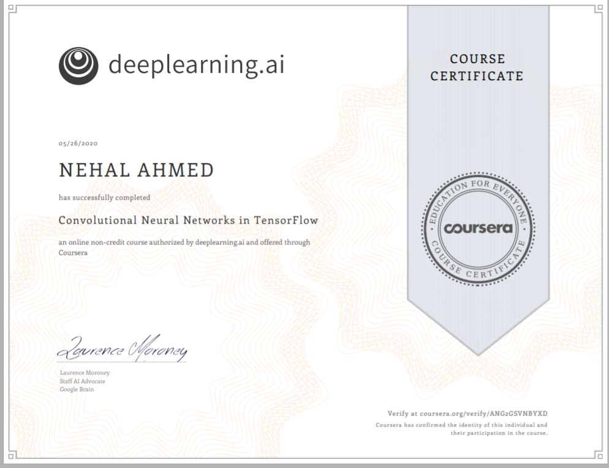
  </td>
  
<td width="30%">
   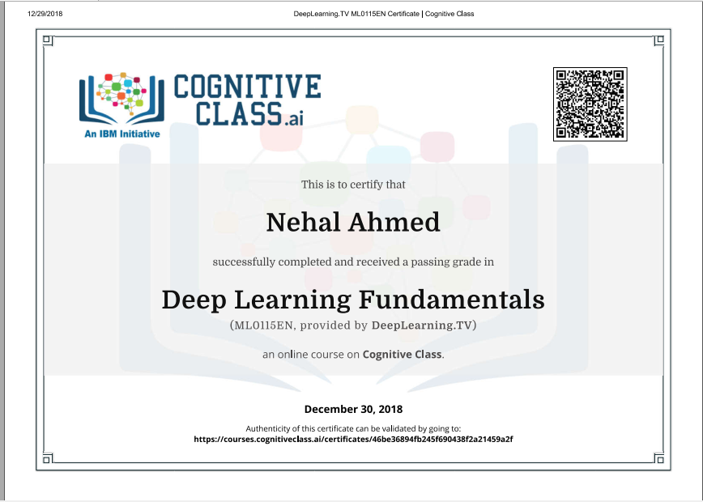
  </td>
  
<td  width="30%">
   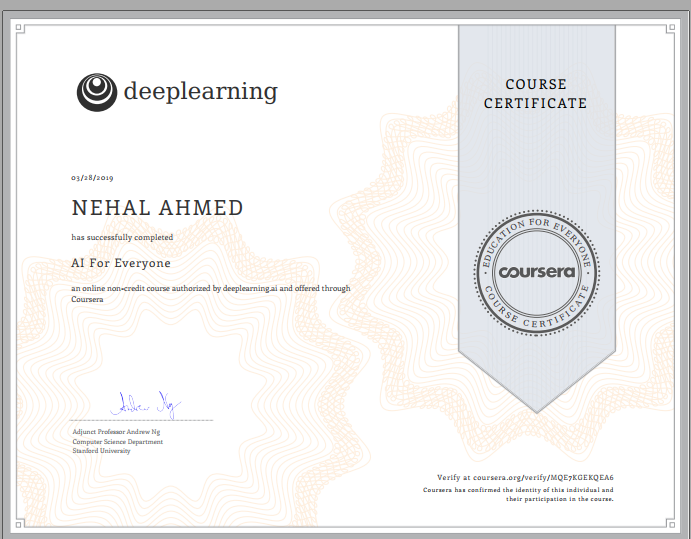
  </td>
  </tr>
  
  
  
  <tr>
<td width="30%">
  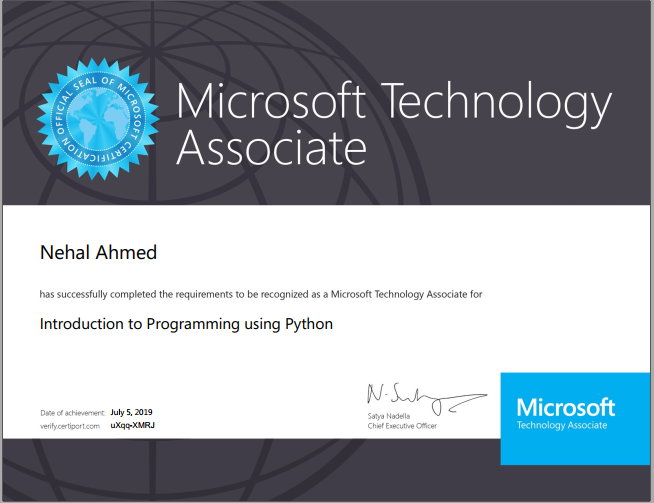
  </td>
  
<td width="30%">
   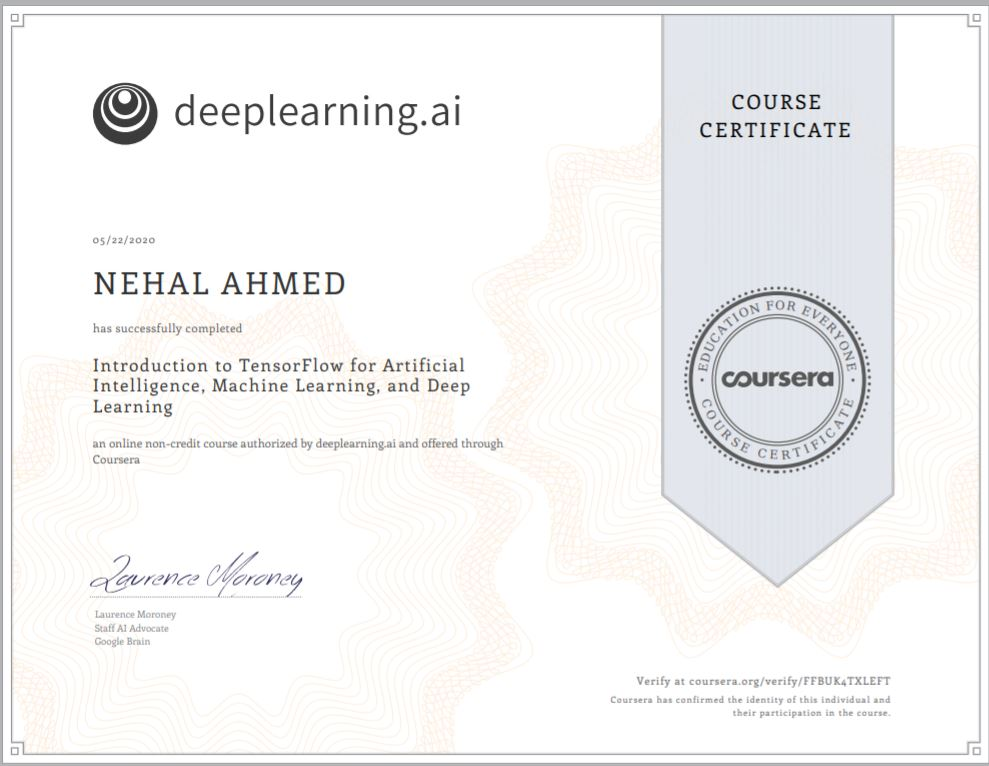
  </td>
  
<td  width="30%">
   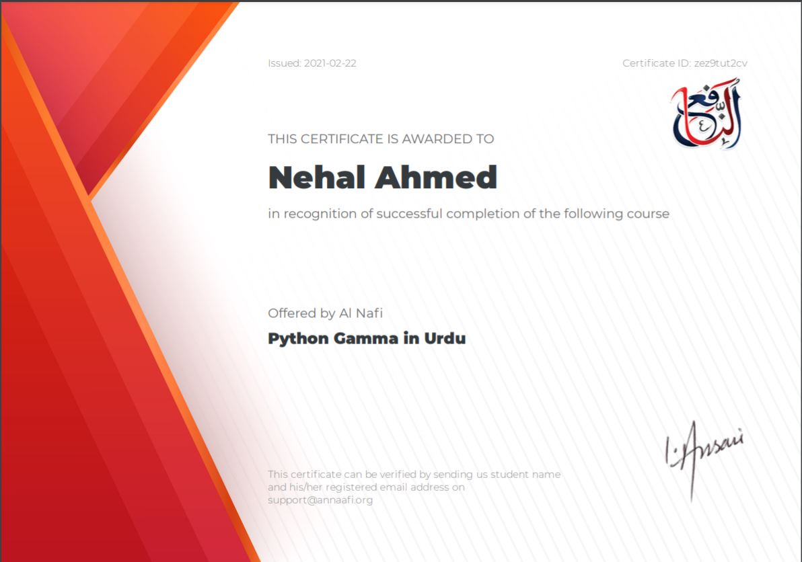
  </td>
  </tr>
  
  
  
 <tr>
<td width="30%">
  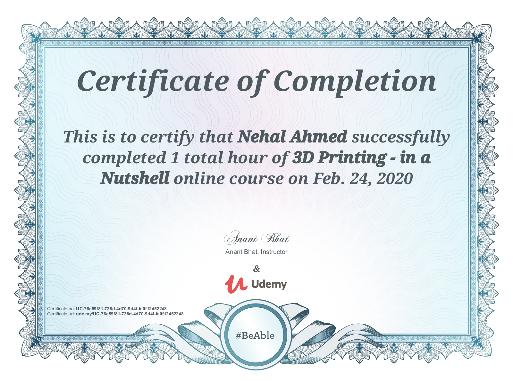
  </td>
  
<td width="30%">
   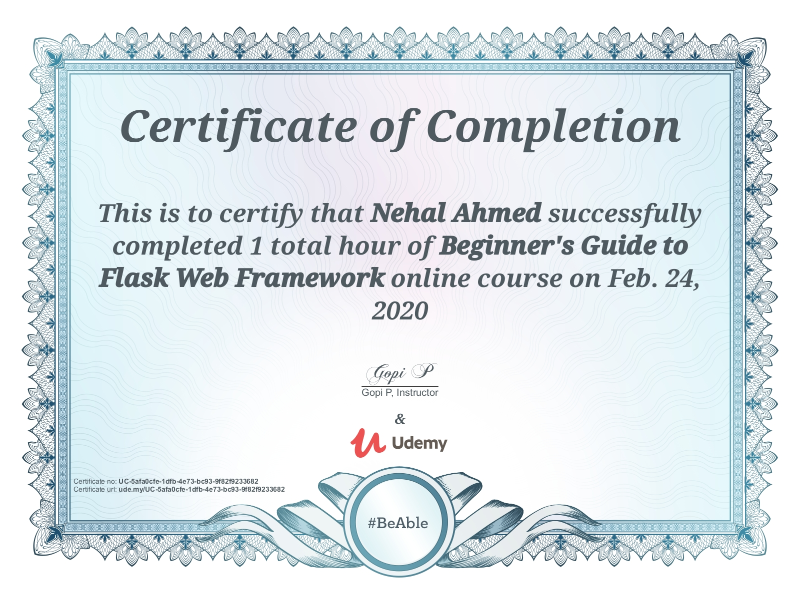
  </td>
  
<td  width="30%">
   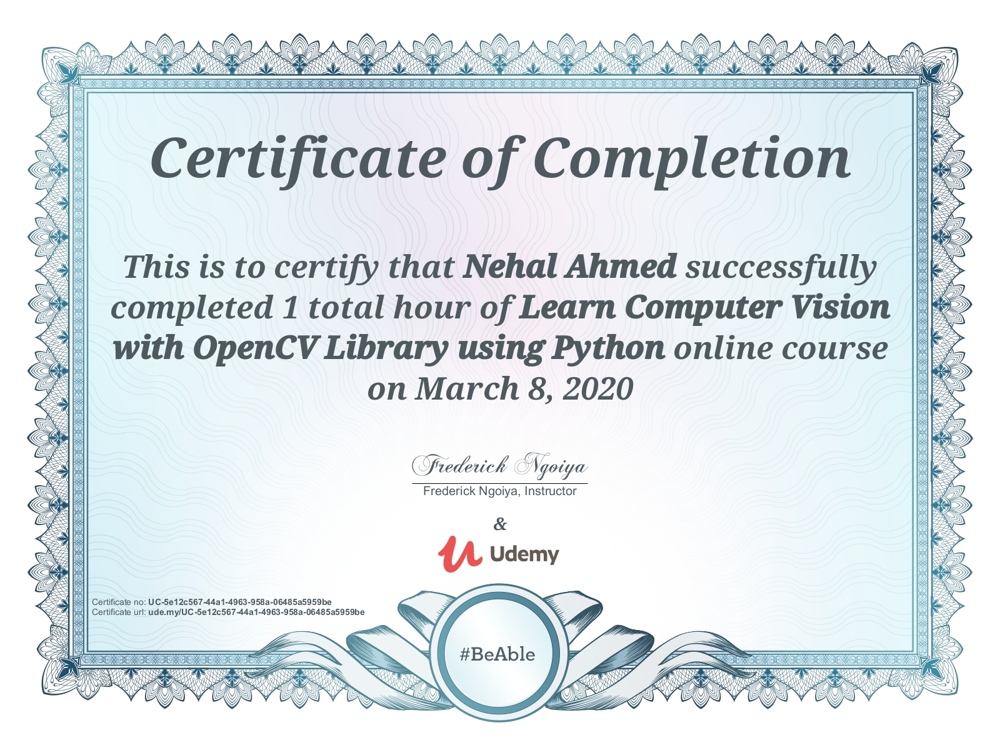
  </td>
  </tr>
  
  
  
  
  
</table>

## Connect Me On:
- Email: nehal.ubit@gmail.com
- Kaggle: https://www.kaggle.com/gatshabz22
- LinkedIn: https://www.linkedin.com/in/nehal-ahmed-072949193/

_**Note:** Please **do not spam** on the above mentioned profiles._
## Some of My Work In the form of Tutorial

_**Note:** Please **Click the Image** and Watch The Video._

 
<a href="[https://www.youtube.com/watch?v=v2384be0_qU&t=24s](https://www.youtube.com/watch?v=t0Bb7Tl6bw4&list=PL1Xmyl4aKTRjyFTjaekHCtxZZdsNBUZKW&index=1)">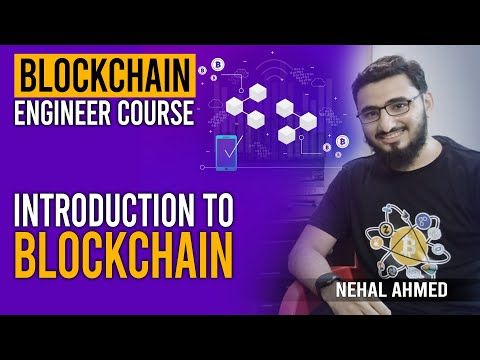</a>

 
<a href="https://www.youtube.com/watch?v=v2384be0_qU&t=24s">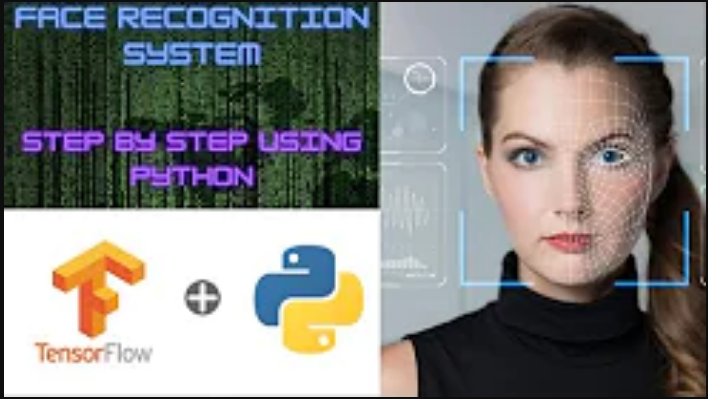</a>

<a href="https://www.youtube.com/watch?v=QIF1eJcytnI&list=PLk6c4eFKmugRp_A-4eYzixYXbeNOOgR0G">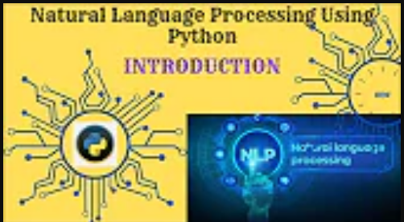</a>

<a href="https://www.youtube.com/watch?v=EnVnqI6crv0">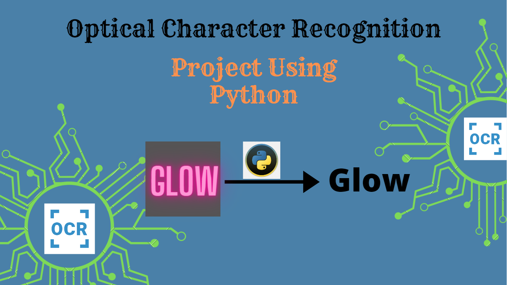</a>

<a href="https://www.youtube.com/watch?v=7n-9kAPWR0k&t=15s">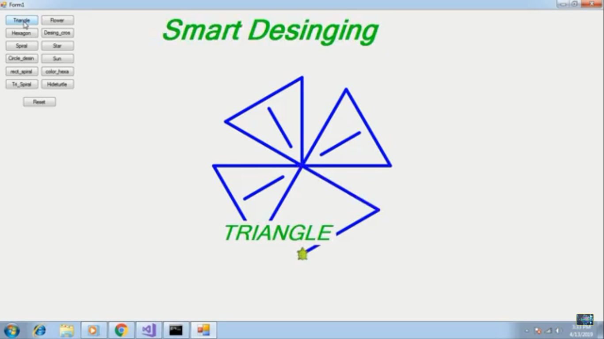</a>

<a href="https://www.youtube.com/watch?v=QRppGRS_DlQ&list=PLk6c4eFKmugQk5fmD4Sy--o6RcV_hnpRr">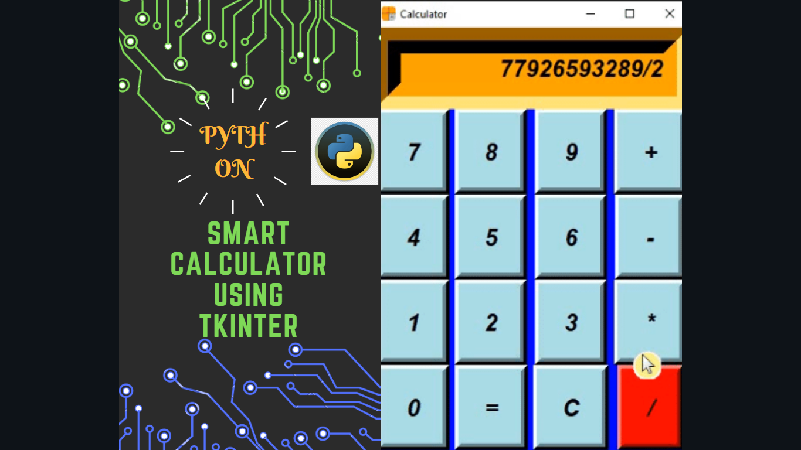</a>

